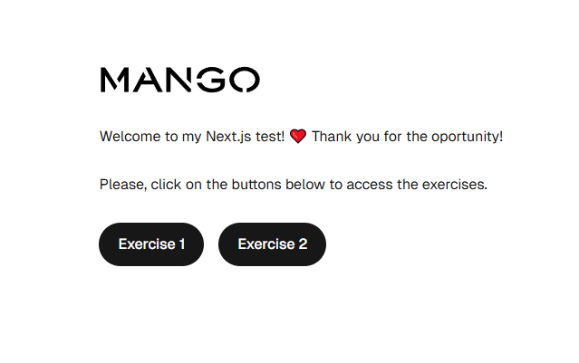
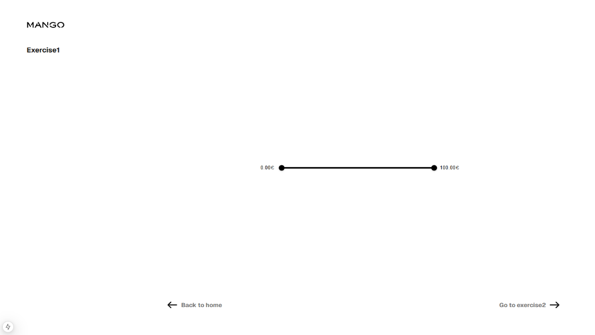
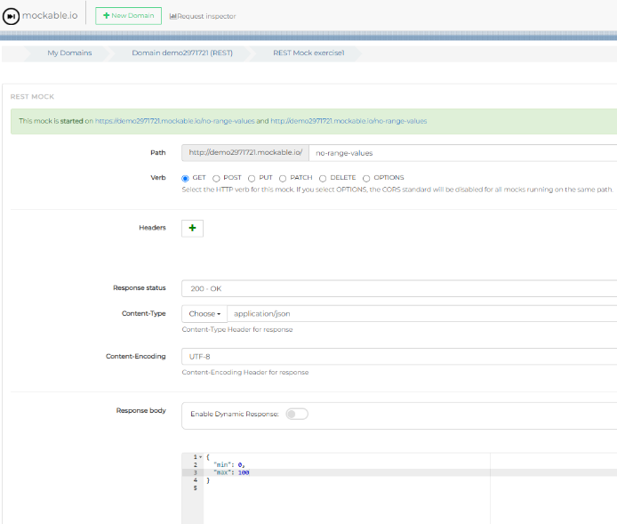

# NEXT.JS TECHNICAL TEST - CUSTOM INPUT RANGE



## Description

Requirement: Create a component: <Range /> that renders a custom input range, that has two use modes:

1. Normal range from min to max number => Receives a min and a max value, to set the range of values.
2. Fixed number of op ons range => Receives an array of numbers, to set te selectable values.



Each exercise must be rendered in a different page, with routes /exercise1 and /exercise2. And the output port must be set to localhost:8080.
The values to use in the component, are get by fetching the data from two different mocks created in [Mockable.io](https://www.mockable.io)



## Technologies Used

- Next.js
- TypeScript
- Styled Components
- Jest
- React-testing-library
- Mockable.io

## Getting Started

1. **Clone the repository**:

```
git clone https://github.com/GemaBarrera/test-mango-nextjs.git
```

2. **Install it with the command npm install or yarn(add)**

3. **Run the development server**:

```bash
npm run dev
# or
yarn dev
```

4. **Open [http://localhost:8080](http://localhost:8080) with your browser to see the result.**

## Deployment

Check out the **[Deployment on Vercel](https://test-mango-nextjs.vercel.app)** for this project.

## Tests

- Unit tests, with jest and react-testing-library.
- Manual testing, in a local environment.

## Comments

- For the **folder structure**, I've decided to use the **App Router** structure, introduced in Next.js13, because it's the most popular and, in my opinion, it's better for organization and scalability. Although, it would have been also correct to use the classic **Pages Router** from Next.js.
- For **fetching the data** from the API, I used **fetch** in each page, to get the data in the server side. If I would have chosen Pages Router structure, this should have been done using getSererSideProps or even getStaticProps, as the data is not constantly changing. I could have also added an attribute -cache: 'force-cache'- to my fetch response to achieve the same effect as getStaticProps.
- The **ouput port localhost:8080**, in this case I think it's correct to set it in the package.json's scripts, but in a real project, this kind of configurations should go inside an .env file with environment variables, to facilitate changes and scalability.
- I don't consider it is necessary, in this case, to add a **global state** with Redux or Context api.
- In first place, I did the exercises assuming that the front could receive always a json with the same **properties** (min, max, rangeValues), but the rangeValues could be empty or not. But I was not sure about that was what was being requested. Then I changed the types and components to all the properties not be mandatory.
- Mock urls => http://demo2971721.mockable.io/no-range-values & http://demo2971721.mockable.io/range-values

## Possible Improvements

- More test could have been added, as the coverage is not 100%.
- Styles could be more accurate, but I would need the fonts, sizes and margins from a dessign.
- For a component like this, it's good to add tests e2e, for example with Cypress, to ensure the correct behavior with user interactions.
- Accessibility improvements.
